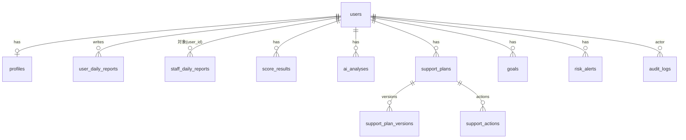

# データベース設計

開発: SQLite / 本番: PostgreSQL（`DATABASE_URL` で切替）。
SQLAlchemy 2.x（Mapped / mapped_column）+ Alembic で管理する。

## 共通方針

- 主キーは整数 `id`（autoincrement）
- 日時は UTC の `DateTime`、日付は `Date`
- JSON列は SQLite/PostgreSQL 両対応の `JSON` 型
- 外部キーには index を付与
- 論理削除は使わず `is_active` 等の状態列で制御

## ER概要

## テーブル定義

### users
| 列 | 型 | 制約 |
|---|---|---|
| id | int | PK |
| email | str(255) | UNIQUE, NOT NULL, index |
| password_hash | str(255) | NOT NULL |
| role | str(20) | NOT NULL（admin / staff / user）CHECK |
| is_active | bool | default true |
| created_at / updated_at | datetime | |

### profiles
| 列 | 型 | 制約 |
|---|---|---|
| id | int | PK |
| user_id | int | FK users.id, UNIQUE |
| display_name | str(100) | NOT NULL |
| date_of_birth | date | NULL可 |
| support_start_date | date | NULL可 |
| assigned_staff_id | int | FK users.id, NULL可（利用者の担当スタッフ） |
| notes | text | NULL可 |

### user_daily_reports（利用者日報）
| 列 | 型 | 備考 |
|---|---|---|
| id | int | PK |
| user_id | int | FK users.id |
| report_date | date | **UNIQUE(user_id, report_date)** |
| mood | int 1..5 | 今日の気分 |
| sleep_hours | float 0..24 | |
| bedtime / wake_time | str "HH:MM" | 時刻文字列（タイムゾーン非依存） |
| sleep_quality | int 1..5 | |
| breakfast_status / lunch_status / dinner_status | str | eaten / partial / skipped |
| exercise_minutes / work_study_minutes | int ≥0 | |
| stress_level / fatigue_level / social_level | int 1..5 | |
| achievement / success_experience / difficulty / tomorrow_goal / free_text | text | 自由記述 |
| is_draft | bool | 下書き保存 |
| created_at / updated_at | datetime | |

下書き（is_draft=true）の間は必須項目未入力を許容する（mood等はNULL可、確定時に検証）。

### staff_daily_reports（スタッフ日報）
| 列 | 型 | 備考 |
|---|---|---|
| id | int | PK |
| user_id | int | FK users.id（対象利用者） |
| staff_id | int | FK users.id（記録スタッフ） |
| report_date | date | |
| support_minutes | int | 支援時間（分） |
| support_content / user_condition / conversation_summary / positive_points / issues / behavior_changes / support_method / user_response / next_check / free_text | text | |
| urgency | str | normal / caution / check / urgent |
| created_at / updated_at | datetime | |

### score_results
| 列 | 型 | 備考 |
|---|---|---|
| id | int | PK |
| user_id | int | FK, UNIQUE(user_id, score_date) |
| score_date | date | |
| life_rhythm_score / sleep_score / mental_score / wellbeing_score / self_efficacy_score / work_readiness_score | int 0..100 | NULL=算出不能 |
| stress_status | str | low / normal / elevated / high |
| breakdown_json | JSON | 計算根拠（各内訳点） |
| calculation_version | str | 例 "1.0" |
| created_at | datetime | |

### ai_analyses
| 列 | 型 | 備考 |
|---|---|---|
| id | int | PK |
| user_id | int | FK |
| analysis_date | date | |
| analysis_type | str | daily_analysis / support_plan / risk_review |
| input_period_start / input_period_end | date | |
| model_name | str | mock / gemini-2.0-flash 等 |
| prompt_version | str | |
| result_json | JSON | スキーマ検証済みのAI出力 |
| status | str | success / fallback / failed |
| error_message | text | NULL可 |
| created_at | datetime | |

### support_plans
| 列 | 型 |
|---|---|
| id, user_id(FK), title, status | status: draft / in_review / approved / active / evaluated / closed |
| current_issues, strengths, user_preferences, background_hypothesis, long_term_goal | text |
| short_term_goals_json, support_methods_json, home_actions_json, office_actions_json, user_actions_json, evaluation_metrics_json | JSON（文字列配列） |
| evaluation_date, next_review_date | date |
| created_by, approved_by | FK users.id |
| approved_at, created_at, updated_at | datetime |
| notes | text（注意事項） |

### support_plan_versions
id, support_plan_id(FK), version_number(int), snapshot_json(JSON), changed_by(FK), change_reason(text), created_at

### support_actions（支援実施記録・効果測定）
id, user_id(FK), support_plan_id(FK NULL可), staff_id(FK), action_date(date), action_content(text), user_response(text), effect_score(int 1..5 NULL可), next_action(text), created_at

### goals
id, user_id(FK), title, description, target_date(date), status(active/achieved/paused/closed), progress(int 0..100), created_at, updated_at

### risk_alerts
id, user_id(FK), alert_type(str), severity(low/medium/high), reason(text), source_data_json(JSON), status(open/acknowledged), acknowledged_by(FK NULL), acknowledged_at, created_at

### audit_logs
id, actor_user_id(FK NULL), action(str 例 "login", "report.create"), target_type(str), target_id(int NULL), details_json(JSON), created_at

### system_settings
id, setting_key(str UNIQUE), setting_value_json(JSON), updated_by(FK NULL), updated_at

初期キー: `scoring_weights`（スコア配点。管理画面から編集可能）

## インデックス

- user_daily_reports(user_id, report_date) UNIQUE
- staff_daily_reports(user_id, report_date), staff_daily_reports(staff_id)
- score_results(user_id, score_date) UNIQUE
- ai_analyses(user_id, created_at)
- risk_alerts(status), audit_logs(created_at)
